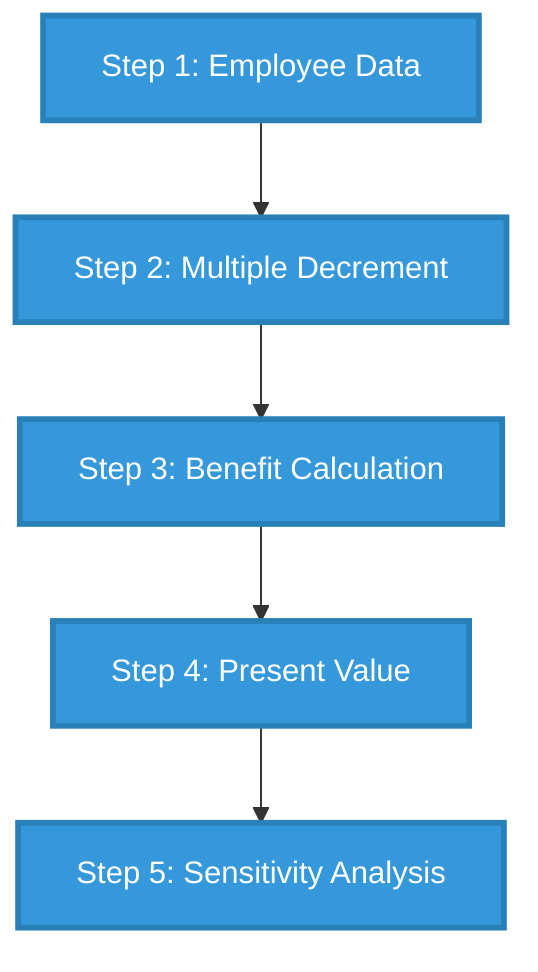
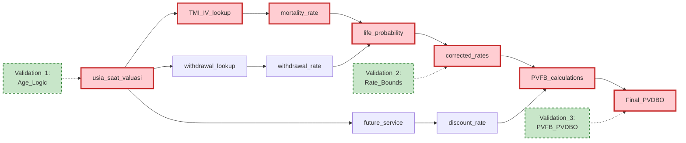
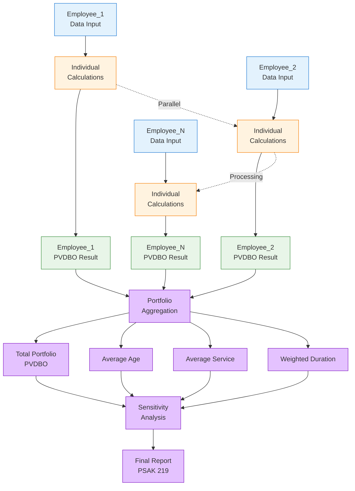

# 🧮 Calculation Guide - PSAK 219

## 📖 **Overview**

Panduan lengkap perhitungan valuasi aktuaria untuk imbalan kerja sesuai PSAK 219. Dokumen ini memberikan roadmap untuk menghitung kewajiban aktuaria perusahaan.

## 🤖 **RAG Usage Patterns**

### **Tier 1: Direct Lookup (1-2 chunks)**

**Examples:**
- "Pension factor for 15 years service under UUCK" → `benefit_factors_uuck.md` chunk
- "TMI IV mortality rate for 45-year-old male" → `tmi_iv_mortality.md` age 45 chunk
- "IGSYC yield for 10 years" → `yield_curve_igsyc.md` 10-year chunk

### **Tier 2: Single Calculation (3-5 chunks)**

**Examples:**
- "Calculate death benefit for 30-year-old with 5 years service, 10M salary"
- "Determine discount rate for employee retiring in 12 years"
- "Apply salary increase assumption to current 8M monthly salary over 20 years"

#### **Tier 3: Multi-Step Workflow (8-15 chunks)**

**Examples:**
- "Full PVDBO calculation for male employee age 45, 20 years service, 15M salary"
- "Sensitivity analysis for discount rate ±1% on portfolio PVDBO"
- "Compare UUK13 vs UUCK benefits for same employee profile"

### **Troubleshooting Queries**

**Examples:**
- "Why is my PVDBO calculation negative?"
- "How to handle employees already at retirement age?"
- "Validation failed for service period calculation"


## 🗺️ **Detailed Actuarial Calculation Flow**

### **1. High-Level Process Flow**



**Legend:**

- 🔵 **Blue**: Main calculation steps in PSAK 219 process


### **2. Detailed Variable Flow**

```mermaid
graph TD
    %% Step 1 Outputs
    A1[tanggal_lahir] --> B1[usia_saat_valuasi]
    A2[tanggal_masuk_kerja] --> B2[masa_kerja_lalu] 
    A3[tanggal_valuasi] --> B1
    A4[usia_pensiun] --> B3[future_service]
    A5[gaji_pokok] --> B4[total_gaji_saat_valuasi]
    A6[tunjangan_tetap] --> B4
    A7[tingkat_kenaikan_gaji] --> B5[total_gaji_pensiun]
    
    %% Step 1 to Step 2
    B1 --> C1[TMI_IV_lookup]
    B1 --> C2[withdrawal_table_lookup]
    A8[gender] --> C1
    B3 --> C3[pension_rate_dasar]
    
    %% Step 2 Calculations
    C1 --> C4[mortality_rate_dasar]
    C4 --> C5[disability_rate_dasar]
    C2 --> C6[withdrawal_rate_dasar]
    C3 --> C7[pension_rate_dasar]
    
    C4 --> C8[life_probability]
    C5 --> C8
    C6 --> C8
    C7 --> C8
    
    C8 --> C9[corrected_rates]
    C4 --> C9
    C5 --> C9
    C6 --> C9
    C7 --> C9
    
    %% Step 2 to Step 3
    B2 --> D1[benefit_factor_lookup]
    A9[masa_kerja_lalu_ifric] --> D2[pension_factor_lookup]
    A10[program_type] --> D1
    A10 --> D2
    
    %% Step 3 Calculations  
    D1 --> D3[death_factor]
    D1 --> D4[disability_factor]
    D1 --> D5[withdrawal_factor]
    D2 --> D6[pension_factor]
    
    B4 --> D7[death_benefit_gross]
    B4 --> D8[disability_benefit_gross]
    B4 --> D9[withdrawal_benefit_gross]
    B5 --> D10[pension_benefit_gross]
    
    D3 --> D7
    D4 --> D8
    D5 --> D9
    D6 --> D10
    
    %% Step 3 to Step 4
    D7 --> E1[PVFB_death]
    D8 --> E2[PVFB_disability]
    D9 --> E3[PVFB_withdrawal]
    D10 --> E4[PVFB_pension]
    
    C9 --> E1
    C9 --> E2
    C9 --> E3
    C9 --> E4
    
    B3 --> E5[discount_rate_lookup]
    E5 --> E6[discount_factor]
    
    E6 --> E1
    E6 --> E2
    E6 --> E3
    E6 --> E4
    
    %% Step 4 Calculations
    E1 --> E7[CSC_death]
    E2 --> E8[CSC_disability]
    E3 --> E9[CSC_withdrawal]
    E4 --> E10[CSC_pension]
    
    E1 --> E11[PVDBO_death]
    E2 --> E12[PVDBO_disability]
    E3 --> E13[PVDBO_withdrawal]
    E4 --> E14[PVDBO_pension]
    
    B2 --> E7
    B2 --> E8
    B2 --> E9
    A9 --> E10
    
    A11[service_ratio] --> E11
    A11 --> E12
    A11 --> E13
    A12[service_ratio_ifric] --> E14
    
    %% Step 4 to Step 5
    E11 --> F1[total_PVDBO]
    E12 --> F1
    E13 --> F1
    E14 --> F1
    
    E7 --> F2[total_CSC]
    E8 --> F2
    E9 --> F2
    E10 --> F2
    
    E5 --> F3[sensitivity_analysis]
    A7 --> F3
    
    %% Styling
    classDef step1 fill:#e1f5fe,stroke:#01579b
    classDef step2 fill:#f3e5f5,stroke:#4a148c
    classDef step3 fill:#e8f5e8,stroke:#1b5e20
    classDef step4 fill:#fff3e0,stroke:#e65100
    classDef step5 fill:#fce4ec,stroke:#ad1457
    
    class A1,A2,A3,A4,A5,A6,A7,A8,A9,A10,A11,A12,B1,B2,B3,B4,B5 step1
    class C1,C2,C3,C4,C5,C6,C7,C8,C9 step2
    class D1,D2,D3,D4,D5,D6,D7,D8,D9,D10 step3
    class E1,E2,E3,E4,E5,E6,E7,E8,E9,E10,E11,E12,E13,E14 step4
    class F1,F2,F3 step5
```



**Legend:**

| Color         | Step                         | Variables                                                                                                            |
| ------------- | ---------------------------- | -------------------------------------------------------------------------------------------------------------------- |
| 🔷 Light Blue | Step 1: Employee Data        | tanggal_lahir, usia_saat_valuasi, masa_kerja_lalu, future_service, gaji_pokok, total_gaji_saat_valuasi               |
| 🟣 Purple     | Step 2: Multiple Decrement   | TMI_IV_lookup, mortality_rate_dasar, disability_rate_dasar, withdrawal_rate_dasar, life_probability, corrected_rates |
| 🟢 Green      | Step 3: Benefit Calculation  | benefit_factor_lookup, death_factor, disability_factor, withdrawal_factor, pension_factor, benefit_gross             |
| 🟠 Orange     | Step 4: Present Value        | PVFB, CSC, PVDBO, discount_rate_lookup, discount_factor, service_ratio                                               |
| 🟡 Pink       | Step 5: Sensitivity Analysis | total_PVDBO, total_CSC, sensitivity_analysis                                                                         |

### **3. Critical Data Dependencies**




**Legend:**

- 🔴 **Red (Critical Path)**: Variables that directly impact final PVDBO calculation
- 🟢 **Green Dashed (Validation)**: Key validation checkpoints to prevent calculation errors


### **4. Multi-Employee Portfolio Flow**




**Legend:**

| Color         | Process Stage  | Description                                   |
| ------------- | -------------- | --------------------------------------------- |
| 🔷 Light Blue | Employee Input | Individual employee data collection           |
| 🟠 Orange     | Calculation    | Individual PSAK 219 calculations per employee |
| 🟢 Green      | Results        | Individual employee PVDBO results             |
| 🟣 Purple     | Portfolio      | Portfolio-level aggregation and reporting     |

**Processing Notes:**

- ⚡ **Parallel Processing**: Individual calculations can run simultaneously
- 📊 **Aggregation**: Results combined for portfolio-level metrics


### **5. Error Handling Flow**

```mermaid
flowchart TD
    Start[Start Calculation] --> ValidateAge{Age Valid?<br/>17-70 years}
    
    ValidateAge -->|No| ErrorAge[Age Error:<br/>Outside Range]
    ValidateAge -->|Yes| ValidateService{Service Period<br/>Consistent?}
    
    ValidateService -->|No| ErrorService[Service Error:<br/>Negative/Invalid]
    ValidateService -->|Yes| LookupTMI{TMI IV<br/>Lookup Success?}
    
    LookupTMI -->|No| ErrorTMI[TMI Error:<br/>Invalid Age/Gender]
    LookupTMI -->|Yes| CalcRates[Calculate<br/>Decrement Rates]
    
    CalcRates --> ValidateRates{Rates Valid?<br/>0 ≤ rate ≤ 1}
    
    ValidateRates -->|No| ErrorRates[Rate Error:<br/>Out of Bounds]
    ValidateRates -->|Yes| CalcBenefits[Calculate<br/>Benefits]
    
    CalcBenefits --> ValidatePVDBO{PVDBO ≤ PVFB?}
    
    ValidatePVDBO -->|No| ErrorPVDBO[PVDBO Error:<br/>Exceeds PVFB]
    ValidatePVDBO -->|Yes| Success[Calculation<br/>Complete]
    
    %% Error Recovery
    ErrorAge --> FixAge[Apply Boundary<br/>Values]
    ErrorService --> FixService[Recalculate from<br/>Employment Dates]
    ErrorTMI --> FixTMI[Use Default<br/>Gender/Interpolate]
    ErrorRates --> FixRates[Apply Rate<br/>Caps/Floors]
    ErrorPVDBO --> FixPVDBO[Check Service<br/>Ratio Logic]
    
    FixAge --> ValidateService
    FixService --> LookupTMI  
    FixTMI --> CalcRates
    FixRates --> CalcBenefits
    FixPVDBO --> ValidatePVDBO
    
    classDef normal fill:#e8f5e8,stroke:#388e3c
    classDef error fill:#ffcdd2,stroke:#c62828
    classDef fix fill:#fff3e0,stroke:#f57c00
    classDef decision fill:#e1f5fe,stroke:#1976d2
    
    class Start,CalcRates,CalcBenefits,Success normal
    class ErrorAge,ErrorService,ErrorTMI,ErrorRates,ErrorPVDBO error
    class FixAge,FixService,FixTMI,FixRates,FixPVDBO fix
    class ValidateAge,ValidateService,LookupTMI,ValidateRates,ValidatePVDBO decision
```




**Legend:**

|Shape & Color|Type|Purpose|
|---|---|---|
|🟢 Rectangle|Normal Process|Standard calculation steps|
|🔷 Diamond|Decision Point|Validation checkpoints|
|🔴 Rectangle|Error State|Calculation errors encountered|
|🟠 Rectangle|Recovery Action|Error correction procedures|

**Error Recovery Process:**

1. **Detect Error** → Identify specific validation failure
2. **Apply Fix** → Use boundary values, defaults, or recalculation
3. **Retry Validation** → Return to validation checkpoint
4. **Continue** → Proceed to next step if validation passes

## 📋 **Step-by-Step Process**

### **Step 1: Employee Data Foundation**

📄 **[Step 01 Detailed Guide](step01_employee_data.md)**

**RAG Context:** `employee_data_foundation, basic_calculations`

**Quick Overview:**

- Age calculation from birth date and valuation date
- Service period determination (actual vs IFRIC method)
- Salary projection with increase assumptions
- Future service calculation until retirement

**Key Formulas:**

```formula
💫 Formula: Usia Saat Valuasi
usia_saat_valuasi = (tanggal_valuasi - tanggal_lahir) / 12
```

```formula
💫 Formula: Future Service
future_service = usia_pensiun - usia_saat_valuasi
```

**Validation Checkpoints:**

- Age logic (must be between 17-70)
- Service period consistency
- Salary reasonableness checks

### **Step 2: Multiple Decrement Analysis**

📄 **[Step 02 Detailed Guide](step02_multiple_decrement.md)**

**RAG Context:** `multiple_decrement, probability_calculations, competing_risks, life_tables`

#### **Strategic Importance**

Multiple decrement analysis adalah **inti dari valuasi aktuaria** yang menentukan probabilitas berbagai cara karyawan dapat keluar dari program imbalan kerja. Analisis ini mempengaruhi:

- **Magnitude kewajiban** - Probabilitas tinggi = kewajiban tinggi
- **Timing pembayaran** - Kapan benefit akan dibayarkan
- **Mix benefit types** - Proporsi pension vs death vs disability vs withdrawal
- **Risk assessment** - Profil risiko portofolio karyawan

#### **Key Tables**

**Quick Overview:**

- Mortality rates from TMI IV 2019 tables
- Disability rates (5-10% of mortality)
- Withdrawal rates (company-specific)
- Life probability calculations


**Primary Data Sources:**

- 📊 **[TMI IV Mortality Table](tmi_iv_mortality.md)** - 111 ages, gender-specific rates
    - Coverage: Ages 0-111 years
    - Usage: Daily mortality risk assessment
    - Update: Based on 2019 Indonesian population data
    
- 📊 **[Withdrawal Assumptions](withdrawal_assumptions.md)** - Company policy withdrawal rates
    - Coverage: Ages 15-60 years (working ages)
    - Pattern: High at 20s (6%), declining with age
    - Customization: Industry and company-specific adjustments

**Quick Reference Rates:**

|Age|TMI IV Male|TMI IV Female|Withdrawal Rate|Typical Profile|
|---|---|---|---|---|
|25|0.00052|0.00038|6.00%|Young professionals|
|35|0.00107|0.00080|1.80%|Mid-career stability|
|45|0.00302|0.00187|1.20%|Senior professionals|
|53|0.00667|0.00403|0.60%|Pre-retirement planning|
|55|0.00789|0.00483|0.00%|Retirement transition|

#### **Calculation Dependencies**

**Inputs from Step 1:**

- `usia_saat_valuasi` → Age-based table lookups
- `usia_pensiun` → Pension rate determination
- `gender` → TMI IV table selection
- Employee count → Portfolio-level aggregation

**Outputs to Step 3:**

- `mortality_rate`, `disability_rate`, `withdrawal_rate`, `pension_rate` → Benefit probability weighting
- `life_probability` → Survival adjustment factors

**Critical Integration Points:**

- Age validation must be consistent across steps
- Gender codes must match TMI IV table structure
- Company withdrawal policy alignment with HR systems

#### **Complex Calculation Examples**

**Example 1: Active Employee Near Retirement**

```json
{
  "employee_profile": {
    "usia_saat_valuasi": 53,
    "usia_pensiun": 55,
    "gender": "male",
    "status": "active"
  },
  "base_rates": {
    "mortality_rate_dasar": 0.00667,
    "disability_rate_dasar": 0.000667,
    "withdrawal_rate_dasar": 0.006,
    "pension_rate_dasar": 0.0
  },
  "life_probability_progression": {
    "age_53": 1.000000,
    "age_54": 0.995567,
    "age_55": 0.990727
  },
  "corrected_rates": {
    "age_53": {
      "mortality_rate": 0.006670,
      "disability_rate": 0.000667,
      "withdrawal_rate": 0.006000,
      "pension_rate": 0.000000
    },
    "age_54": {
      "mortality_rate": 0.007240,
      "disability_rate": 0.000724,
      "withdrawal_rate": 0.000000,
      "pension_rate": 0.000000
    },
    "age_55": {
      "mortality_rate": 0.000000,
      "disability_rate": 0.000000,  
      "withdrawal_rate": 0.000000,
      "pension_rate": 1.000000
    }
  }
}
```

**Example 2: Young Employee High Mobility**

```json
{
  "employee_profile": {
    "usia_saat_valuasi": 25,
    "usia_pensiun": 55, 
    "gender": "female",
    "status": "high_turnover_risk"
  },
  "risk_assessment": {
    "primary_risk": "withdrawal",
    "withdrawal_probability": 0.060,
    "mortality_probability": 0.000038,
    "disability_probability": 0.0000038,
    "business_impact": "training_investment_at_risk"
  }
}
```

### **Step 3: Benefit Calculation**

📄 **[Step 03 Detailed Guide](step03_benefit_calculation.md)**

**RAG Context:** `benefit_calculations, regulatory_factors`

**Quick Overview:**

- Benefit factor lookup from program tables (UUK13/UUCK/PP)
- Four benefit types: Pension, Death, Disability, Withdrawal
- Tax considerations (progressive rates)
- Final benefit amount determination

**Key Tables:**

- 📊 **[UUK13 Benefit Factors](benefit_factors_uuk13.md)** - 40 years service
- 📊 **[UUCK Benefit Factors](benefit_factors_uuck.md)** - Updated regulations
- 📊 **[Company Policy Factors](benefit_factors_pp.md)** - Custom programs

**Formula Dependencies:**

- Service years from Step 1
- Salary calculations from Step 1
- Regulatory program selection

### **Step 4: Present Value Calculations**

📄 **[Step 04 Detailed Guide](step04_pvfb_pvdbo.md)**

**RAG Context:** `present_value, financial_calculations`

**Quick Overview:**

- PVFB (Present Value Future Benefits) calculation
- CSC (Current Service Cost) determination
- PVDBO (Present Value Defined Benefit Obligation)
- Discount factor application from yield curves

**Key Tables:**

- 📊 **[IGSYC Yield Curve](yield_curve_igsyc.md)** - Government bond rates

**Complex Dependencies:**

- Benefit amounts from Step 3
- Probabilities from Step 2
- Discount rates based on future service
- Duration matching methodology

### **Step 5: Analysis & Reporting**

📄 **[Step 05 Detailed Guide](step05_sensitivity_analysis.md)**

**RAG Context:** `sensitivity_analysis, reporting, risk_management`

**Quick Overview:**

- Sensitivity analysis for key assumptions
- Maturity profile projections
- Variance analysis and reconciliation
- Risk assessment and scenario planning

**Advanced Topics:**

- Macaulay duration calculations
- Multi-scenario modeling
- PSAK 219 disclosure requirements

## 🎯 **Quick Reference**

### **Most Common Calculations**

|Employee Age|Common Service|Typical Factors|Expected PVDBO Range|
|---|---|---|---|
|25-35|3-10 years|Low multipliers|10-50x monthly salary|
|36-45|11-20 years|Mid multipliers|50-150x monthly salary|
|46-55|21-30 years|High multipliers|150-300x monthly salary|

### **Critical Assumptions Quick Check**

- **Discount Rate**: 6-7% (based on government yield curve)
- **Salary Increase**: 5-12% annually (company historical average)
- **Mortality**: TMI IV 2019 gender-specific tables
- **Withdrawal**: Age-based, highest at 20-29 years (6%)

## 📊 **Reference Tables Summary**

|Table|Size|Usage Frequency|AI Loading Priority|
|---|---|---|---|
|TMI IV Mortality|111 rows|⭐⭐⭐ High|Chunked by age groups|
|UUK13 Benefits|40 rows|⭐⭐⭐ High|Chunked by service years|
|UUCK Benefits|40 rows|⭐⭐ Medium|Chunked by service years|
|Withdrawal Rates|45 rows|⭐⭐ Medium|Pre-loaded common ages|
|IGSYC Yield|30 rows|⭐⭐⭐ High|Pre-loaded 1-15 years|

## 🚀 **Getting Started**

### **For New Users:**

1. Start with **[Employee Data Guide](step01_employee_data.md)**
2. Review **[Reference Tables](assumptions_reference.md)**
3. Follow step-by-step calculation process

### **For Experienced Users:**

- Jump to specific steps as needed
- Use **[Troubleshooting Guide](troubleshooting_guide.md)** for issues
- Reference tables on-demand

### **For AI Processing:**

- Each step file is self-contained with strategic backlinks
- Tables are optimized for chunked loading
- Formula format is standardized across all files


## 🛠️ **RAG Implementation Notes**

### **Complexity Routing**

yaml

```yaml
simple_queries:
  - routing: "direct_table_lookup"
  - examples: ["factor for X years", "rate for age Y"]
  - chunks_needed: 1-2

moderate_queries:
  - routing: "single_step_calculation" 
  - examples: ["calculate benefit amount", "determine discount rate"]
  - chunks_needed: 3-5

complex_queries:
  - routing: "multi_step_workflow"
  - examples: ["full PVDBO calculation", "sensitivity analysis"]
  - chunks_needed: 8-15
```

### **Error Handling Patterns**

- **Missing Data**: Request specific requirements, suggest defaults
- **Out of Range**: Apply boundary conditions with warnings
- **Calculation Errors**: Guide to validation and troubleshooting steps

### **Quality Assurance**

- Mathematical consistency checks at each step
- Regulatory compliance validation
- Business logic verification
- Cross-reference integrity monitoring

---

📎 **Navigation:**

- 📄 [Employee Data](step01_employee_data.md) | [Multiple Decrement](step02_multiple_decrement.md) | [Benefit Calculation](step03_benefit_calculation.md)
- 📊 [Quick Reference](assumptions_reference.md) | [Troubleshooting](troubleshooting_guide.md)

